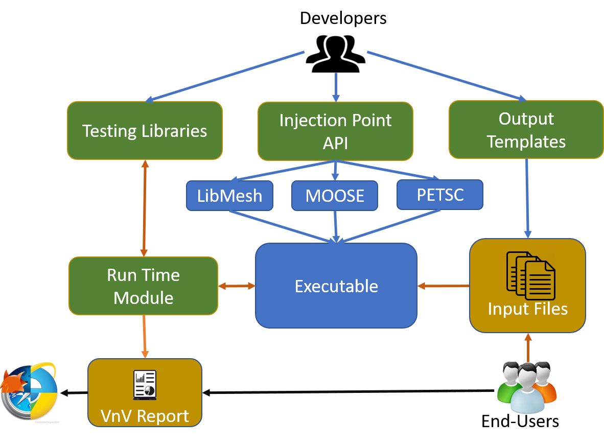

# VnV: A self documenting Testing Framework for In-situ Verification and Validation in HPC Applications.

With access to high performance computational resources at an all time high, and with exascale computing resources on the horizon; the role M&S has in the design pipelines of next generation technologies is only expected to increase. However, numerical simulations are, by definition, an approximation to a real world physical system. As such, it is important that this increased reliance on simulated tests is accompanied by a concerted effort to ensure simulations are fit for the intended purpose.
 
The process of ensuring a code is fit for its intended purpose is called Verification and Validation (V&V) and generally includes:
- Implementation of software development best practices (e.g. version control, unit and regression testing, code reviews, etc.).
 - Mathematical and algorithmic testing (convergence analysis, mesh refinement studies, method of manufactured solutions, etc.).
 - A broad benchmark testing suite including uncertainty quantification and sensitivity analysis.
- Comparison of simulation results with experimental data and results from third party simulations. 
- Review of the implementation and results by experts in the field.

V&V is a discrete process that cannot account for each and every possibility. This raises issues in the development of general purpose numerical simulation packages because, while it is the simulation software developers responsibility to ensure the product is mathematically correct, it is ultimately the responsibility of the end user to ensure the solution is a suitable representation of their physical model. After all, the direct costs of a design failure (be it time, money, or loss of life) fall squarely on the shoulders of the end-user; any attempt to shift the blame to the developers of simulation library *X* will certainly fall on deaf ears.

In this project, RNET and ORNL are developing **VnV: a C/C++ software package that facilitates end-user V&V in general purpose numerical simulation packages**. The framework will promote the development of **explainable numerical simulations** that, in addition to the traditional simulation solution, produce a detailed report outlining how the solution was obtained and why it should be trusted. The VnV framework will provide simple to maintain V&V methods for creating  self verifying, self describing, explainable numerical simulations.

 The VnV framework will facilitate the development of explainable numerical simulations through:
- **In-situ Testing And Analysis:** Unit tests are an effective mechanism for ensuring a function works as expected. However, unit testing is an unavoidably discrete process that cannot cover every possible outcome. This is particularly true for numerical algorithms because even small changes (e.g., input parameters, mesh geometry, etc.) can cause the algorithms to behave unexpectedly (i.e., diverge, converge to the wrong solution, etc.). As such, a robust V&V report should include a description of unit tests completed *and* a detailed set of tests and assertions that were completed during the simulation process. The VnV framework will include a sophisticated test injection system with cross-library support for defining testing points in existing codes. The framework will be able to configure injection points in any library linked to a simulation. For example, a MOOSE user would be able to run V&V tests at injection points defined in the source codes of hypre, PETSc, libMesh, MOOSE, etc through a single interface. This cross library support will allow for in-depth, expert directed, end-user V&V in an executable that utilizes a range of numerical simulation libraries.
- **Reusable Software Components:** While the specific details of V&V vary from application to application, the macro scale algorithms are relatively consistent (e.g., mesh refinement studies, the method of manufactured solutions, sensitivity analysis, uncertainty quantification and error propagation). Many of these algorithms can be, or already have been, implemented as black-box or near black box solutions. The VnV framework will provide a robust set of near black-box tools that implement these common V&V approaches.
- **Efficiency:** Performing V&V tests in a distributed environment will be expensive, both computationally and due to the data movement required to support generic domain decomposition. The VnV framework will offer functionality for offloading tests to external processes. This will significantly reduce the run time costs of completing V&V using the VnV framework.
- **Documentation Generation:** With software packages under almost constant development, and new and improved packages being released on a regular basis, keeping an up-to-date V&V report is an almost impossible task. The VnV toolkit will include automatic VnV report generation in the form of a server-less HTML web page. The report will be built using an extended markdown format with support for standard markdown formatting, latex formatting, images, videos, self-sorting tables, two-dimensional charts, and three-dimensional visualization.
 

*The VnV toolkit. Here, green boxes represent core functionalities. Developer interactions are shown in blue, runtime interactions are shown in orange and post-processing interactions are shown in black.*

The figure above uses the MOOSE tool-chain to show how developers and end-users will interact with the VnV framework. The first step is to define the injection points. These injection points will be placed at key locations of the code where testing can and should take place. Developers will also complete an output template describing the state of the simulation at each injection point. That specification will be used to populate the final VnV report.

The next step is to create a VnV test. The tests are developed in external libraries and hence, can be developed either by the developer of the simulation or by the end-user of the library. The core framework will also include a robust set of general purpose V&V tests. Each test will be accompanied by a markdown formatted template file. Like injection points, this markdown file will be used to describe the test and present the results. The VnV framework supports a custom markdown format that includes a range of data visualization techniques. We envision that the developers of a numerical simulation package will ship the library with hard-coded injection points and a set of custom V&V tests.

End-users will be able to generate a customized input configuration file for each executable. This configuration file will contain information about every injection point located in the call-graph of the simulation; including those in external third party libraries. After customizing that file, generating a VnV report is as simple as running the simulation.

Overall, once integrated into an application, the VnV framework will provide a simple mechanism for creating self verifying, self describing, explainable numerical simulations. This will significantly reduce the burden associated with V&V for end users, thereby increasing the usability of the tools for non-expert end-users. 